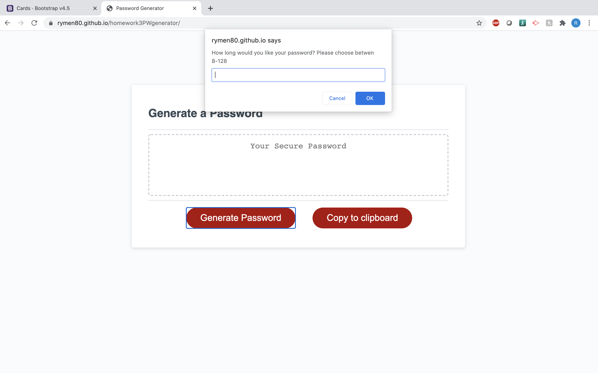
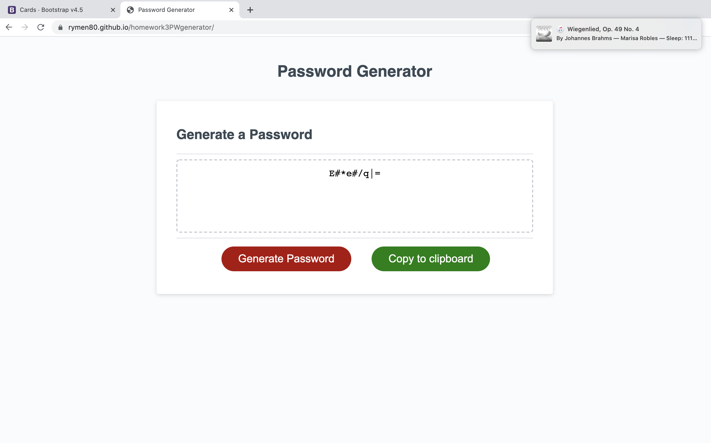
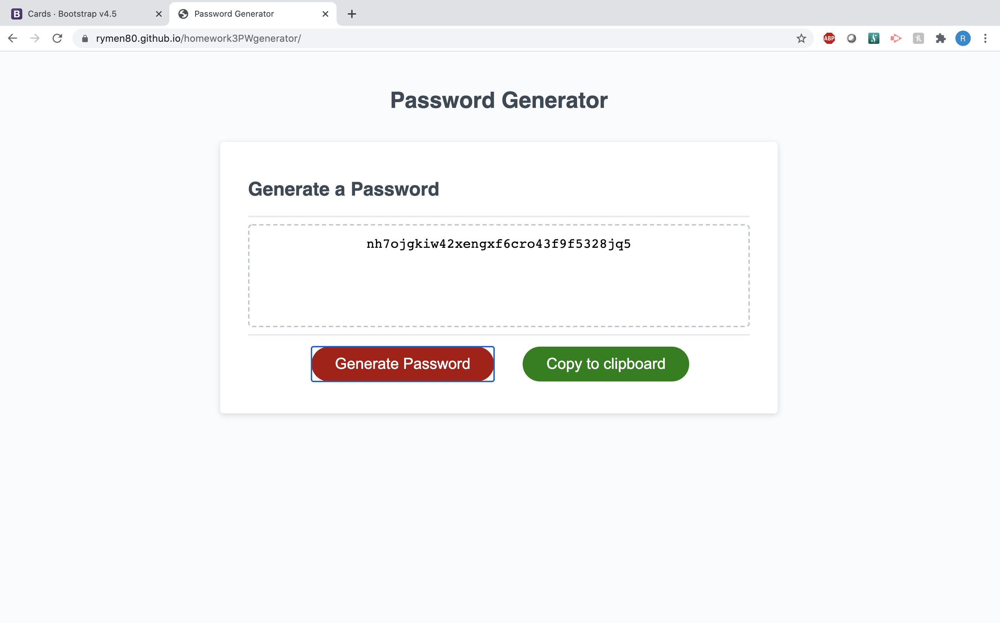
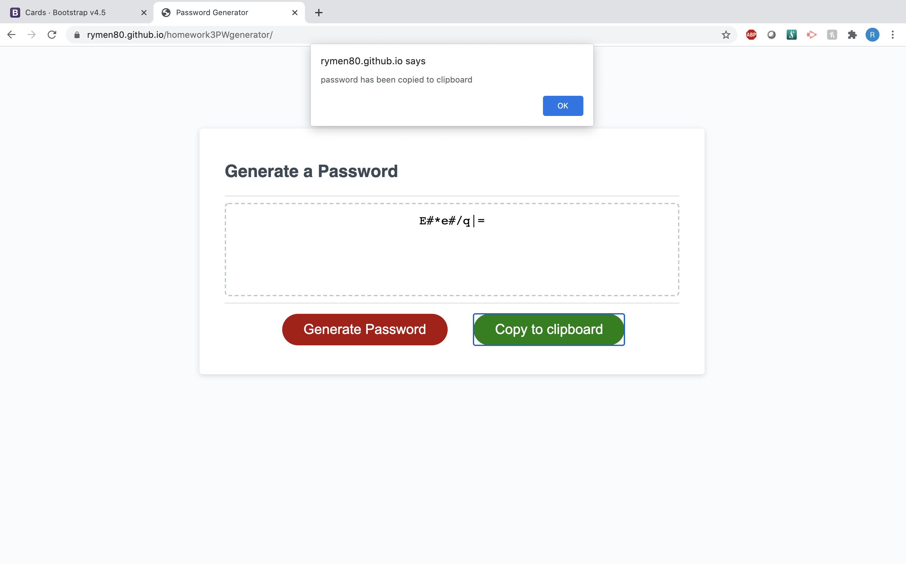

In this assignment we were given the task to create a website that will generate a password.
User is asked how long they would like password to be and what characters to include.
Given user selections of what to be included I used random generator to select from said criteria.
Output produces a random string of charaters the user can copy to clipboard and use as as password.

Challange of this task was to make sure all characters user wanted were included and none that they did not.
Also challaged with understanding how javascript can interact with the .html file using DOM methods.

